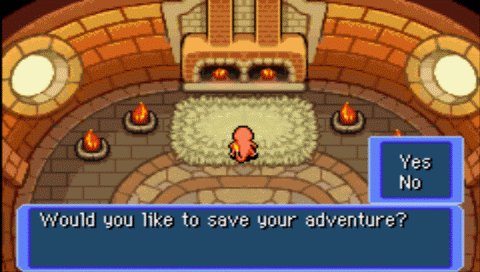
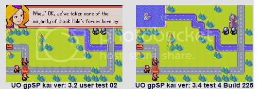
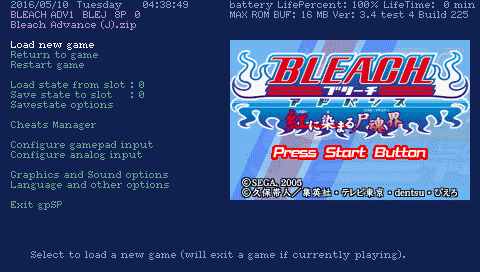

<b><i>Unofficial gpSP kai crated by Takka</b>
-gameplaySP Gameboy Advance emulator for Playstation Portable.</I>

## Credits

- <b>Exophase</b> : main developer - Official release <b><i>"gpSP"</b></i> 0.91.

- <b>takka</b> : developer - Unofficial release <b><i>"Uo gpSP kai"</b></i> 3.4 test 3 build 92.

- <b>toBsucht</b> : for testing and helping translating.

## Known issues (minor problems)

- <u>Compatibility list</u>

**- Note : Some games workarounds trick, 32mb Rom only works unzip.**

1. <b><i>Sigma Star Saga</i></b> : still unable to show health bar.

2. <b><i>Golden Sun series</i></b> : sound issue, still unplayable.
The game is 'DragonBall Z Legacy of Goku 2'. There is a sequence in the game in which you have to fly to a different location. The problem is, whenever I try to do so the message 'the game will not run in this hardware' appears on the screen.

3. <b><i>Powder 117</b></i> and <i><b>Qwak</i></b> : failed to run.

4. <b><i>Golden Sun</b></i> : it's Sequel Major Bugs,Still Considered Unplayable.

5. <b><i>Kingdoms Hearts : Chain of Memories</b></i> : Works Unzip file, it freezes at the opening movie and the sound goes all messed up, Simply, before the game freezes on intro video, quicksave the game, then load it back, it should work normally.

6. <b><i>Riviera</b></i> : Works - Only Run Unzip file.

7. <b><i>Grand Theft Auto Advance</b></i> - has a bug that after starting dialogues game crashes.
Save allows you to bypass the damaged portion in the dump of the Rom.

   [GTA Advance .SAV file](http://www.mediafire.com/file/7ts7jm7ihpl81v4/Grand_Theft_Auto_Advance_SAV.zip/file)
expanded in GBA/SAV folder.
The name of conservation should be exactly the same as ZIP archive, which is ROM gba under any name.
When loading a game, choose load of preservation, and not as a new game.
5. <b><i>Pokemon Mystery Dungeon - Red Rescue Team</b></i> - a reached to save room in the tent where he slept Pokemon, and game normally saved.
Then he came out of the emulator and again went to the game, and the game is booted normally, like you have in the picture "Continue" (Resume your adventure from where you last saved.).
the size of saving: 128 KB (131,072 bytes).
Preserved under the name : "Pokemon Mystery Dungeon - Red Rescue Team.sav"
In the folder : UO gpSP kai/GBA/SAV

<code>(E)</code> version of Pokemon Mystery Dungeon has the save problem. <code>(U)</code>version works fine.

2567 - Pokemon Mystery Dungeon - Red Rescue Team (E)(Rising Sun).gba = POKE DUNGEON B24P 01 0 = Save failed!

2485 - Pokemon Mystery Dungeon - Red Rescue Team (U)(RDG).gba        = POKE DUNGEON B24E 01 0 = Save completed!

8. <b><i>Advance War 2</b></i> : Popup on the top always didn't show up. Popup on the bottom works like normal, only the top have a problem.
See the different :

UO gpSP kai 3.4 test 3 Build 92 also have same problem.old version of gpSP 3.2 user test 02 no problems at all.

9. <b><i>Megaman Battle Network 1</b></i> : End of the game when entering underground railroad.

10. <b><i>Megaman Battle Network 4</b></i> : Apparently an unknown random virus encounter.

11. <b><i>Breath of Fire 2</b></i> : Highfort after boss battle during escape scene.

12. <b><i>Wario Ware Inc.</b></i> : Final Wario Games in Story Mode, graphics will randomly glitch between games, making it impossible to play any games afterwards.

13. <b><i>Mario Advanced 4</b></i> : (And probably many other games)
Patching GBA ROMs.
If other games works using the ROM patching solution.

14. <b><i>Sims 2 Pets</b></i> : Graphically Glitched, but not unplayable.
15. <b><i>Banjo Kazooie Grunty's Revenge</b></i> : Crashes to bios in the very beggining.
16. <b><i>DragonBall Z Legacy of Goku</b></i> : Freezes after hack announce.
17. <b><i>DemiKids Light Version</b></i> : Crashes before begin a game.
18. <b><i>Digimon Racing</b></i> : Freezes on beggining.
19. <b><i>Doom 2</b></i> : Bad scaling, freezes on beggining.
20. <b><i>Harry Potter Quidditch World Cup</b></i> : Minor Graphical Glitches, and freezes before entering games.
21. <b><i>Harry Potter and The Order of Phoenix</b></i> : Constantly coming back to Langauge selection screen.
22. <b><i>Mario Tennis Power Tour</b></i> : Crashes to BIOS.
23. <b><i>MegaMan Zero</b></i> : Heavy Graphical Glitches.
24. <b><i>NBA Jam 2002</b></i> : Blank Screen on start.
25. <b><i>Pokemon Pinball Ruby and Sapphire</b></i> : White Screen on start.
26. <b><i>Rayman Raving Rabbids</b></i> : Heavy Graphical Glitches.
27. <b><i>Steel Empire</b></i> : Black Screen at start.
28. <b><i>Super Monkey Ball Jr.</b></i> : Game crashes, was working on version 1.0.4.
29. <b><i>Street Racing Syndicate</b></i> : Crashing when choosing language.
30. <b><i>DragonBall Z Legacy of Goku 2</b></i> : Work fine, but sound issue
31. <b><i>Metroid Zero Mission</b></i> : Work fine, sound issue A weird warping of the music that causes the audio to bob and weave, as well as a periodic, persistent ticking sound.
32. <b><i>Mother 3</b></i> : Work unzip, .sav problem.
33. <b><i>Pokemon Mystery Dungeon - Red Rescue Team</b></i> : Work unzip, .sav problem.
<i>a real save, not a save state.
the game is not able to load/create a save file, it says "the game cannot be saved"
tempGBA can load/save just fine.</i>

in game
place a .SAV in your rom directory.

1.gpSP

2.TempGBA

**Note : 32mb Save working on TempGBA. and gpSP it is still unsupported 32mb save data.**

**Note : Other games are working great.**

## <h3>RAM</h3>

1. Bleach Advance                             : 32.0 MB
2. Kingdom Hearts - Chain of Memories         : 32.0 MB
3. Mother 3                                   : 32.0 MB
4. Riviera - The Promised Land                : 32.0 MB
5. Pokemon Mystery Dungeon - Red Rescue Team  : 32.0 MB

Simply, if a large 32MB game in a ZIP-archive then it will be a long time in the TEMP unpacked, you just need to wait a minute, there is a diode will blink rapidly.
If you do not want to wait, and to play immediately loaded, then unzip and run *.gba.
Generally I normally work all of these games.

- UO gpSP Kai 3.4 test 4 build 225 = 16mb Max
- UO gpSP Kai 3.5 Mod = 32mb Max
- UO gpSP Kai 3.4 test 3 build 152 = 32mb Max

32mb Max ROM Buff achieved when Unlock Extra Memory is enabled from Recovery Menu... If I disable Unlock Extra Memory, it is 16mb again but other gpSP emulators are still 32mb Max ROM Buff.
32mb ROM / 32mb buff = Faster loading, less glitchy
32mb ROM / 16mb Buff = Very slow loading, PSP freeze sometimes, unpacks and duplicates *.zip ROM to *.gba so uses more space. At least it does on a few other gpSP emulators.

## Creating & Adding Cheats

[Uo gpSP kai Cheats](https://github.com/PSP-Archive/emulator-cheats/releases/tag/0.2)

<u><b>::Requirements::</b></u>

- Action Replay or Gameshark Codes for a certain game
- gpSP Kai Cheat Creator.exe [Downlaod](https://github.com/PSP-Archive/emulator-cheats/releases/tag/0.2)
- Hacked PSP with the most recent gpSP Kai

1) All gpSP Kai cheat codes should be inserted in ms0:/PSP/Game/gpSP Kai/GBA/CHT , assuming that gpSP Kai is any version of the Gameboy Advance Emulator. These cheat codes have a specific format, which is .cht .

2) Gather the Action Reply/Gameshark codes that you want and open up the gpSP Kai Cheat Creator.exe program. Enter the game name at the top bar in the program (i.e. Pokemon Emerald). The game name will help you identify the cheat file.

3) There is a specific form in which you need to enter these codes to get a .cht file.

<u>Action Replay Form :</u>

PAR_V3 (name of code) <---make sure PAR_V3 and the code name is separated by a space
XXXXXXXX YYYYYYYY
XXXXXXXX YYYYYYYY

Enter the code as shown in the X and Y column above if it is an Action Reply Code. Remember that there are 8 characters in each column because it is an Action Replay Code. Column X is separated from Column Y with a space. If the code has more than two lines, do not get part of it and instead get the whole thing.

<u>Gameshark Form :</u>

gameshark_V3 (name of code) <-----again, gameshark_V3 is separated from the code name
XXXXXXXXXXXX
XXXXXXXXXXXX

Enter the code as shown in the X rows. In gameshark form, there are not columns, but there are rows. Remember that there are 12 characters in each row because it is in gameshark form. After one row ends, another row starts. If the code has more than two lines, do not get part of it and instead get the whole thing.

4) Enter the codes that you have gathered in the wide box area of the gpSP Kai cheat creator program after you put them in the gameshark/Action Replay form from above. After every code, make sure to not leave them attached to eachother, for this will mess up the code. Press the "enter" key to separate them.

5) Create the .cht file after you enter all the codes.

6) Connect your PSP to your computer using a USB Cord. Go to this directory: ms0:/PSP/GAME/gpSP Kai/GBA/CHT . This directory may not be the same as others, and if that is the case, then just look for the CHT folder in your gpSP Kai.

7) Insert your new .cht file into the CHT Folder

8) Disconnect your PSP from the USB Cord and start up your gpSP Kai. After you start the game that you made the .cht file for, press the triangle button to open up the gpSP Kai menu. In that menu, you should see the words "Cheats and Miscellaneous Options". Click on those words to take you to the cheats part of the menu.

9) Go to "Load Cheat File". Then, you will see the .cht file that you recently created. Click on that cheat file.

10) Loading the certain .cht file will show you the cheats that are in that .cht file. You can disable/enable those cheats in the menu.

## Comparison

<b><i>TempGBA-mod vs Uo gpSP kai</b></i>

TempGBA-mod, I was wondering which emulator is better, im saying this because the video quality in tempGBA's "150% SW" mode, make the video output look much cleaner, dunno what exactly is the difference between it and "GU" (which looks a lot like the video output gpSP has) but just looks better.
i also noticed that pokemon fire red and ultra violet dont tell me that the 1m chip isnt there, does tempGBA support 1m saves while gpSP doesn't?
nvm, figured out that tempGBA has a rudimentary version of this, each game has its own control profile
why is it that neither emulator saves the CPU frenquency i set it to? <--- figured out how to make tempGBA do it, gpSP seemingly cant do it.
UO gpSP Kai to be the fastest. It does support 1M saves too. Here's the latest version: [Uo gpSP kai mod 3.5](http://www.mediafire.com/file/daukxkdjmpjat94/uo_gpsp_kai_latest.tar.lzma/file)
i said regarding 1m saves is that for some reason they gave me an error in gpSP but not on tempGBA, so if the support is there, why doesnt it work?
TempGBA is supposed to have better compatibility / less glitches for some games than gpSP (e.g. Golden Sun). The speed, as far I could see back when I used gpSP is about the same.

As for the "GU" output, that's supposed to be accelerated video (=faster), whereas SW is software, which should probably be slower, although theoretically more accurate (less glitches). I use GU all the time though, and have yet to find a game that has any problem with it.

## Change log

-<b>Unofficial gpSP Kai 3.4 Test 4 Build 230</b>
        Fixed regression: Analog Nub mapping works separately from Dpad again.
        Fixed regression: Now by default, GBA button 'B' is mapped to 'Cross' and GBA button 'A' is
        mapped to 'Circle' to match a real GBA. The 225 build had these buttons reversed by default.
       'Update backup' is now defaulted to 'Automatic' rather than 'Exit only'. It can still be
        configured on a per game basis.

<b>Update</b>
Use this new '230' build, not the '228' build I originally uploaded (there was a bug in keymapping). Also, if you used the 'cfg' folder from the '228' archive, replace it with the one in this '230' archive or the '225' archive (they're both the same).
Also, in addition to the 'Slim' build, the 'Fat' build is now tested as well and reported to be working fine.

-<b>Unofficial gpSP kai 3.4 Test 4 Build 225</b>
Fixed lots of bugs, mostly inconsistencies in the program code and the code to be translated.
Added new lines in the emulator menu and accordingly in translation language files.
Painted pixel by pixel, and compiled a new font "eureka.fbm".
Also in the font added all German-Spanish-Portuguese-Greek characters umlauts with full Western European encoding cp1252 with the required width for each letter.
Fixed some items are broken before.
Fixed alternating list by changing the buttons in the joystick configuration.
Now run almost all games from ZIP archives. Previously, large files are not unpacked emulator.

<b>Other minor fixes.</b>

Signed to run on the official firmware, and of course on the custom firmware.
For emulator is available about 3000 games *.gba or *.bin format. [note: sentence removed by mods]
To save space on the memory card, compress images * .gba in ZIP-format archives.
Images should be expanded in the folder: "UO gрSP kai \ GBA \ ROM".

-<b>Unofficial gpSP kai 3.4 test 4 build</b>
	Compatible with CFW 5.50GEN-B
	Corrected some sound gaps

-<b>Unofficial gpSP kai 3.4 test 3 build</b>
	Fixed freezing when 1MB of memory cannot be secured when decompressing ZIP (PSP-2000 / 3000)
	Added screen enlargement / reduction settings (only when the main unit is displayed)

-<b>Unofficial gpSP kai 3.4 test 2 build 69</b>
	Adjusted the priority of the main font and sub font (I think the "wo button problem" has been fixed)
	Fixed the GBA folder missing in the distribution file
	Some people cannot install it without preparing the ms0 / PSP / GAME / gpSP folder in the distribution file, so fix it.
	Since the state save data was incompatible, it was corrected so that the old version can also be read.
	Added format version in state save data
	Abolished reading of old state file (506947 byte file)
	Fixed continuous access to Memory Stick during state menu

-<b>Unofficial gpSP kai 3.4 test 1 build 2</b>
	Compatible with ChickHEN R2 (Check 32MB memory usage and ZIP file loading on PSP-2000)
	Fixed a bug when using ZIP files on PSP-1000
	Supports booting from the BIOS (I just want to hear that picone)
	Other minor corrections

-<b>Unofficial gpSP kai 3.3 test 2 build 132 svn.402</b>
	Fixed freeze when loading ZIP file a second time
	Supports reading ZIP files above the ROM buffer
		(Create ZIP_TMP.gba after decompression in the ROM folder. Please be careful about the free space)

-<b>Unofficial gpSP kai 3.3 test 2 build 49 svn.399</b>
	Separate cheats and other options
	Revive C-core ARM emulation for debugging
	Enabled to switch ARM emulation between C core and ASM core (valid after restart)
	Restore the ROM cache that was temporarily reduced to 1MB
	Reduce the RAM cache a little by that amount
	Expand the PSP-1000 decompression buffer to 320KB when decompressing the ZIP file
	BMP buffer on general purpose VRAM, saving about 112.5KB of memory
	Secure 16MB ROM buffer on PSP-1000
	Change icon / image to pochi's
	Added some fonts (included in ZIP file, not network update)
	Fixed freezing when font initialization fails
	Fixed checking other than 0 bit of IME register when interrupting IRQ (it is unknown whether there was a problem due to this)
	Added an option to boot as an old model for debugging (valid after reboot)
	Added an option for debugging (note that the test information will be written to the memory stick)

-<b>Unofficial gpSP kai 3.3 test 1 build 172 svn rev.392</b>
	Fixed R repeated hits not being enabled
	Add build number
	Fixed sound gap during load state
	In case of CFW3.71 M33-3 or less, PSP-2000 does not support TV output / additional memory.
	Supports LF + CR for line feed code in video.cfg
	In order to support CFW3.95GEN, the additional memory is managed by itself as before.
	When decompressing the ZIP file, PSP-2000 uses (maximum) 16MB of decompression buffer (PSP-1000 is 256KB)

-<b>Unofficial gpSP kai 3.2 test 9.0 svn rev.</b>
	Fixed buffer over in message screen title
	Fixed memory corruption when releasing font memory

-<b>Unofficial gpSP kai 3.2 test 8.8 svn rev.</b>
	Fixed running out of memory and hanging when reading a ZIP file on an older model
	Change ZIP file read buffer to VRAM
	Change ZIP file read buffer to 128KB-> 256KB
	Looking at the source of the assembler, it was also optimized by switch, so I returned byte / word writing to the IO register to the switch statement (gcc clever)

-<b>Unofficial gpSP kai 3.2 test 8.7 svn rev.</b>
	The behavior of the "o" and "x" buttons in the menu is now matched to the PSP settings.
	Relaxed cheat name length limit (UTF-8N secures 40 characters)
	Changed memory management in fbm_print.c to malloc / free
	Fixed a hang on exit with the HOME key
	Corrected the byte-by-byte writing process to OAM
	Fixed missing 1 line at 1: 1 output
	Adjust parameters for TV output
	Fixed a video initialization bug
	Deleted the built-in TV output parameters (do not output TV if video.cfg cannot be read normally)
	Fixed some textures wrapping around the edges of the screen (a parameter was avoided until test 8.6)
	Use jump table to write byte / word to IO register to stabilize speed
	Added cheat documentation

-<b>Unofficial gpSP kai 3.2 test 8.6 svn rev.</b>
	Fixed a bug in translucent processing

-<b>Unofficial gpSP kai 3.2 test 8.5 svn rev.</b>
	Fixed a bug in clear_screen ()
	Change the character code of the font file to UCS2
	In line with the above, I converted Naga 10 to UCS2 and converted it to fbm.
	Change the character code of the message file to unicode (UTF-8N)
	Added 10-dot font of Hangul characters
	Change the format of font.cfg
		The first is the main font file
		The second is the sub font file
		Subfont glyphs take precedence
	Removed translucent processing of character display
	Added language setting to "Cheat / Other" options
		It will be enabled at the next startup
	Rename the settings folder to cfg to support updates from the PSP itself
	(It seems that the path name to install is limited to 12 characters)
	Similarly, change the standard installation folder to gpSP
	Similarly, change the GBA save folder to GBA / SAV

	Source code
	Global variables prefixed with g_ (still only part)
	Generalization of scrollbar ()
	Generalization of FILE_READ_MEM and FILE_WRITE_MEM
	Separate the video emulation section and the source around the screen drawing

-<b>Unofficial gpSP kai 3.2 test 8 svn rev.360</b>
	Switching to the menu is a little faster
	Fixed a mistake in switching to the TV screen at startup
	Fixed a keymap read / save error
	Fully adjusted TV output parameters
	A little faster screen_flip ()
	Removed all build settings in kernel mode
	Removed all C-core emulated parts
	Integrate cpu_threaded.c into cpu.c
	Organize savestate related macros
	TV output / ratio 16: 9 / Change settings for enlarged display
	* When outputting TV at ratio 16: 9, black frames are created at the top and bottom, so the resolution is inferior to ratio 4: 3.

-<b>Unofficial gpSP kai 3.2 test 07 svn rev.351</b>
	Change message file
	Added HOME button enable / disable to MENU cheat / other settings
	Added ratio / interlace setting for TV output to graphic / sound settings in MENU
	The screen ratio doesn't do anything internally, just load the corresponding parameters
	Added HOME button setting value to gpsp.cfg
	Added keymap settings to gpsp.cfg
	(The size is 36byte-> 104byte, but it will be updated automatically)
	Updated video.cfg so that the menu screen of the PSP main unit is not filtered
	Keymap can now be switched between default and game specific
	Fixed game cfg not being saved at exit
	Fixed the filter settings not being reflected
	It was not compatible with CFW3.60 of PSP-2000, so it was fixed.

-<b>Unofficial gpSP kai 3.2 test 06 svn rev.346</b>
	Change message file
		Renamed message / font files for Russian
		Added Chinese / Korean message / font file (not translated, content is the same as English)
		Added screen mode option1 / option2 to message file
	Around config
		Added video.cfg
			If the file does not exist, it will start with the standard settings.
			It does not check for errors, so it freezes depending on the parameters.
			As a sample, option 1 is set to 180 degree rotation mode.
		Add header to cfg file
		Changed gpsp config and game config to structs,
		Significant changes around config
		Change key settings, backup settings, and audio buffer settings to game-specific settings
	Around the screen
		Change all parameters around screen settings to structure
		Consolidate and abolish functions around screen settings by the above
		Enabled to expand the menu screen at the time of TV output (current parameters have not been adjusted)
		Subtly added comments around GU
		Double buffered MENU screen to reduce flicker
		GU now clears the screen
		Added 2 types of screen size options (option1, option2)
		video.cfg has screen ratio and interlace settings, but I haven't added it to the MENU, so it's currently 4: 3, non-interlaced.
	Other
		Adjusted GBA memory initialization
		Increased cache buffer (solved some malfunctions, temporary measures, seems to be accessing illegal memory somewhere)
		Fixed the menu / game screen switching at high speed when the HOME key is held down.
		The clock setting value is made into a table

-<b>Unofficial gpSP kai 3.2 test 05 svn rev.319</b>
	Adjusted the stack size to deal with problems when using ZIP files
	Supports menu with HOME button
		(Currently there is no volume display, but it will be implemented in test06)
	Extend and use NJ's homehook.prx so that it can read other than the HOME button
		(The volume button and NOTE button can also be read)
	Significantly changed the directory structure of the source
	I found that prx can use kernel mode specific functions, so I deleted the kernel mode compile setting.
		#Ifdef etc. still remain in the source. Will be deleted in the future.
	Supports full screen of TV output
		Supports PSP-2000 & CFW.71 only
		Regardless of the settings of the main unit, you can switch by connecting the cable and entering and exiting the menu even during the game
		The maximum area of ​​image output seems to be 690x460
		In full screen mode, some of the top, bottom, left, and right are not displayed, but it is a beautiful display because it is an integral multiple.
		In 3: 2 magnified mode, the entire area is displayed
		The internal rendering itself is the same as GBA 240x160
		The operation was confirmed by connecting the D terminal of LCD-TV241XBR-2.
		S / composite has no cable, and the component has no connected device, so I have not confirmed it.
		(I think that it is compatible with the monitor, I would like to read the file as a parameter at the time of TV out in the future)
	Restored the volume of the sound

-<b>Unofficial gpSP kai 3.2 test 04 svn rev.282</b>
	Dealing with freeze bugs when using zip files
	Corresponds to memory corruption during sleep on PSP-2000 (referred to Mr. NJ's comment on HP)

-<b>Unofficial gpSP kai 3.2 test 03 svn rev.278</b>
	Added AHDOC initialization / initialization test
		If WLAN is ON, read, standby test, and disconnect the module.
	Corrected the sound deviation of DirectSound

-<b>Unofficial gpSP kai 3.2 test 02 svn rev.271</b>
	Added firmware version check to determine additional memory
	Removal of thin lines at the top and bottom displayed when magnified
	Split Makefile
	Binary integration into FW3.xx user mode / 64MB version
	Fixed moving to graphics / sound options screen when canceling ROM loading screen

-<b>Unofficial gpSP kai 3.2 test 01 svn rev.260</b>
	Fixed a bug where state load slots were misaligned
	Supports builds for FW3.xx user mode
	Supports increased memory of new PSP
	Build with SDK included with standard PSPSDK + 3.71M33

-<b>Unofficial gpSP kai 3.1 svn rev.252</b>
	Change directory for make
	Fixed the dust display on the right end when enlarged
	Fixed a bug that disturbed the sound
	Fixed a state save / load bug

-<b>Unofficial gpSP kai 3.1 test 18 svn rev.241</b>
	Adjustment at the time of enlarged screen
	Delete GUI alpha blend function / table data
	Added SLOT 10 to state save
	SLOT10 loads / saves to memory without using a memory stick
		The contents will be overwritten when loading / saving to the memory stick.
		Destroyed at exit and when loading roms
	Added CRC32 to ROM INFO
		"0" is displayed for ROMs larger than 16MB
	Added yes / no dialog
	Display dialog when loading / saving state
	The analog ON / OFF setting is also enabled on the menu screen.
	Fixed freeze issue on Mario & Luigi RPG

-<b>Unofficial gpSP kai 3.1 test 17 svn rev.225</b>
	Fixed a slight chipping at the top and bottom when enlarging the screen
	Fixed a bug in save state from the menu screen
	ROM info is always displayed on the menu screen
	Fixed IWRAM reading embug
	Readjust ARM / THUMB ADC / SBC / RSC instructions
		Bug fixes in bit Generations Boundish
	Fixed the screen being distorted in some ROMs
	Fixed noise / screen disturbance during load / save state

-<b>Unofficial gpSP kai 3.1 test 16 svn rev.220</b>
	Fixed the screen being distorted in some ROMs
	Suspend reaction speed improvement
	Supports the display of the progress bar on the GBA screen
	Show progress bar during load / save state
	Add scrollbar

-<b>Unofficial gpSP kai 3.1 test 15 svn rev.213</b>
	Changed to move to the menu when the HOME button is pressed
		Improved response when pressing HOME
	Added display of progress bar when loading
	Supports transparency of palette0 for the time being (supports OBJ where Bit Generations / Dotstream is not displayed)
		There may be a problem with other ROMs, so we are waiting for information.

-<b>Unofficial gpSP kai 3.1 test 14 svn rev.209</b>
	Adjusted frame skip behavior during save state
	UI addition (NJ's CPS2 Emu source has been reused)
		Please forgive that there is no sense in the color scheme. We are waiting for a better color scheme
	If WLAN is ON at startup, perform a connection test
	Fixed HOME and VOL +/- keys not working under heavy load

-<b>Unofficial gpSP kai 3.1 test 13 svn rev.202</b>
	Fixed regular noise
	Fixed ZIP file becoming unreadable

-<b>Unofficial gpSP kai 3.1 test 12 svn rev.198</b>
	Fixed a bug in directory relative references
		Fixed a bug that save data could not be loaded

-<b>Unofficial gpSP kai 3.1 test 11 svn rev.191</b>
	Correspondence of sound noise
	Tilt sensor adjustment
	Supports cheat ROM writing (6aaaaaaa 0000dddd pattern)
		However, only ROM of 16MB or less
		Once enabled, it will not be disabled
	Icon change (provided by frmb0001)
		If you add a background, the title will not be displayed, so leave it out in the test version
	Free translation of BIOS error messages
	Save memory by changing the internal format of message data
	Change the palette to make it a little faster
	Sound thread adjustment
	Adjusted frame skip behavior during load state
	Timer adjustment
	Change directory settings to relative references

-<b>Unofficial gpSP kai 3.1 test 10 svn rev.177</b>
	Sound ON / OFF enabled
	Mounted tilt sensor (can be operated with analog PAD / set all assignments to NONE when using)
	Fine adjustment in various places
	BIOS 0xD / getChecksum implementation

-<b>Unofficial gpSP kai 3.1 test 09 svn rev.170</b>
	Fixed a bug that state save data could not be read
		Sorry, I can't read the data saved in test 8
	Sound thread adjustment

-<b>Unofficial gpSP kai 3.1 test 08 svn rev.165</b>
	Adjusting the sound delay
	Adjusting frame skip processing
	Fixed sound bugs
	Fixed regular noise
	Enabled sound buffer setting

-<b>Unofficial gpSP kai 3.1 test 07 svn rev.150</b>
	Adjusting timer processing
	Adjusting the sound delay
		Sound buffer settings are not currently working, are internal fixation
		We plan to remove the sound buffer settings in the future
		The current setting is twice as accurate as before
		The deviation for each channel is currently under investigation.

-<b>Unofficial gpSP kai 3.1 test 06 svn rev.135</b>
	Fixed a bug when reading a ZIP file

-<b>Unofficial gpSP kai 3.1 test 05.1 svn rev.129</b>
	Fixed sound delay

-<b>Unofficial gpSP kai 3.1 test 05 svn rev.125</b>
	Changed to work in kernel mode
	Made non-SDL around the sound
	Fixed dates display in statesave
	Due to the above, the size of the statesave file has been changed to 506947-> 506951.
		Old files are automatically detected and read when reading
		Will be saved in new format when saved
	Change default directory
	Abolition of split EBOOT.PBP
		If you are using DEVHOOK or FW1.0 ~ 1.5, please do it yourself.
	Many corrections based on the source from the forum thanks ?????

-<b>Unofficial gpSP kai 3.1 test 04 svn rev.65</b>
	Reduction of petit noise
	Changed the number of cheats to 30
	Supports cheat menu page switching
	Fixed cheating not working
	Supports increasing cheats for game cfg files
		Delete the old game cfg file, the new one is 136 bytes

-<b>Unofficial gpSP kai 3.1 test 03 svn rev.45</b>
	Corresponds to freeze at the time of sleeve
		After returning to the sleeve, the menu screen will appear.

-<b>Unofficial gpSP kai 3.1 test 02</b>
	A little optimization
	Returned the sound buffer setting to 2048 ~
	Correspondence of regular petit noise of sound

-<b>Unofficial gpSP kai 3.1 test 01</b>
	Ignore illegal BIOS calls
		Supports some special ROMs
	Adjust a little around the sound
	Readjusted ARM / THUMB SBC / RSC instructions
		Corresponds to the sound of Donkey Kong 3 not coming out
	Temporary support for I / O registers 0x410 to 0x800
		Supports some special ROMs

-<b>Unofficial gpSP kai 3.0</b>
	Organize the sauce a little

-<b>Unofficial gpSP kai ml 3.00 test 10</b>
	Fixed a mistake in the BIOS settings
	Fixed displaying extra I / O when displaying FPS

-<b>Unofficial gpSP kai ml 3.00 test 9</b>
	Backup save bug fix
	Screenshots implemented in BMP
		PNG library is no longer needed
	Fixed a bug that save data is corrupted depending on the timing
	Temporarily implement BIOS HALT
	Adjusted around BIOS call for future

-<b>Unofficial gpSP kai ml 3.00 test 8</b>
	Support for FF6A
		Fixed a bug in the c flag of the thumb sbc instruction
	Hang in screenshot. Scheduled to be fixed in test 9
	Fixed a momentary blue screen when exiting without loading the rom
	Kingdom Hearts-Chain of Memories movie no longer freezes (although the image is tattered)

-<b>Unofficial gpSP kai ml 3.00 test 7</b>
	Restored BIOS processing except for divArm
		Because there were many defects (some things are hard to throw away in terms of speed, so I want to do something in the future)
	Changed to display the remaining memory and the buffer size for ROM.

-<b>Unofficial gpSP kai ml 3.00 test 6</b>
	Correct the sound gap
	Fixed status error on the save data selection screen of Metroid Fusion
	Native implementation of divArm, sqrt, cpuset, cpufastset in BIOS
		Tests to work without BIOS in the future
		Kingdom Hearts can no longer be started
	Modify Makefile

-<b>Unofficial gpSP kai ml 3.00 test 5</b>
	Further modified timer counter processing
		Bug fix for Yugdra Union
	Modify Makefile
	It seems that these two points occur only in special situations, so leave it as it is for the time being
	A little optimization around the sound
	Includes ver1.0 and ver1.5 from this time

-<b>Unofficial gpSP kai ml 3.00 test 4</b>
	Fixed a bug where RPG Maker Advance sounds strange
		Fixed timer counter processing
	The sound was tiny and noisy, so I changed part of mips_stub.S back to 0.9.

-<b>Unofficial gpSP kai ml 3.00 test 3</b>
	Most of the changes in gpSP 0.91 have been incorporated
		The rest is a debug implementation and porting arm_stub.S / arm_emit.h for PSP respectively.
	Partially fixed hang on wake when putting PSP to sleep when running 32MB ROM
		If you put it to sleep with the menu displayed, it will not hang.
	A little optimization and high accuracy around the sound
	A little optimization around the screen display
		The above two points improve 2-3 FPS
	Added Japanese ROM to 0.91 game_config.txt

-<b>Unofficial gpSP kai ml 3.00 test 2</b>
	Incorporated some changes in gpSP 0.91
		FPS display (assigned to an appropriate key in the key config and used)
		VOL UP / DOWN is not implemented
	Updating the msg file as described above
	Fixed not being able to exit with the HOME button

-<b>Unofficial gpSP kai ml 3.00 test 1</b>
	Incorporated some changes in gpSP 0.91
		I haven't taken in much because the cpu area needs major changes.
		I haven't made any minor corrections
	Add Italian message file
	Add icon image
		thanks Luca Lefebre

-<b>Unofficial gpSP kai ml 2.92</b>
	Supports multi-language
		Automatically use files in the language selected in the PSP language settings
	Rename message.cfg / font.cfg to * .msg / *. Fnt
	Move dir.cfg/*.msg/*.fnt under setting /
	Only Japanese can be used, so please rewrite each other than English / Japanese.

-<b>Unofficial gpSP kai jp 2.91</b>
	Enabled to boot even with non-genuine BIOS
	Add message.cfg

-<b>Unofficial gpSP kai jp 2.9</b>
	Added clock display / battery level display in the menu
	Changed to return to 222MHz at the end
	When returning to the game with the ○ or × button from the menu, the button is not recognized in the game
		(Returns when the button is released)
	Added movement every 5 lines with R / L button when selecting ROM etc.
	Correction of RTC circumference / mips_stub.S based on the information sent to BBS
	Refer to PSP registry for date and time display format
	Corresponds to hiding corrupted files for folder names for 1.5
	Can be booted with a genuine GBA / NDS BIOS
	I put "_" between the ROM name and the slot number of the statesave file name.
	Added screenshot function to graphic / sound settings in menu
		PNG RGB 24bit format is saved in the folder set in dir.cfg with the ROM file name + date and time.
	Added operation with analog keys at the time of menu
	Changes to message.cfg / dir.cfg due to the above
	The order of the messages has been changed to make it easier to customize the menu screen.
	Add translation of message.cfg
	Added import cheat file to menu
	Supports unencrypted cheats
		The format is
			direct_v? Cheat name
			AAAAAAAA DDDDDDDD
		direct_v? is an identifier for non-encryption, and v1 can use unencrypted data for PAR V1 / V2 and v3 for PAR V3.
		AAAAAAAA is the opcode / address, DDDDDDDD is the data

	Requires libpng to build from source

-<b>Unofficial gpSP kai jp 2.8</b>
	Based on gpSP0.9 ~
	Separate various messages into message.cfg ~
	New font setting file font.cfg ~
	Multilingual support by preparing fbm font and message.cfg ~
	Various directory setting files dir.cfg are newly established ~
	Fixed the sound buffer dropping at 2048 (for the time being) ~
	When saving backup is finished, backup is saved even when closing with HOME key ~
	When saving backup is finished, backup is saved even when another game is loaded ~
	Supports up to 8 idle_loop_eliminate_target ~
	Changed to use PSP main unit settings for state save / RTC time ~

	About the format of the cfg file
		Lines beginning with # are comment statements
		The data is from the beginning of the line to the line break.
		If the! Statement follows, it will be concatenated internally
		It's just reading in order, so if you change the order, it won't work properly.
		Up to 511 bytes per data. If it exceeds, it will not work properly
		I rarely check for errors
		When editing a message, be sure to leave% s,% d, etc. in the data

-<b>gpSP kai 2.7</b>
	Missing number

-<b>gpSP kai 2.6</b>
	kai 2.5 bug fix
		Bug fix (re-fix) when reading / writing vram
			Correction when reading / writing to 0x18000
		Fixed some vram being destroyed
		Swap RL channels of sound (also fix gbc compatible sound) (from Mr. 96)
	Acceleration / optimization
		Cheat code turned off as standard
			Build with make -e "OPT = -DCHEAT" if needed
		Remove unnecessary variable operations in the main loop
		Changed part of mips_stub.S to use delay slot (from Mr. 5)
		Expanded mips_stub.S macro to use delay slot
	New support
		Made Momotaro Dentetsu work (from Mr. 5)

	Expansion
	Add debug mode
		Debug mode is added by building with make -e "OPT = -DDEBUG_MODE"
		Set the screen size to debug and switch the display mode by △ + up and down.
		mode 0 No display
		mode 1 Displayed in synchronization with VBALNK interrupt
		mode 2 Displayed in synchronization with HBLANK interrupt

	for eLoader
		Changed not to set the clock
		It seems to start with the clock set by eloader

	About build-time options
		Create an executable file for 1.5 with make kxploit
		set options with make -e "OPT = ～"
			OPT = -DDEBUG_MODE Debug mode
			OPT = -DCHEAT cheat enabled
			Supports OPT = -DELOADER eLoader
		Example) Create an executable file for 1.5 with eLoader, debug, and cheat support
			make kxploit -e "OPT = -DDEBUG_MODE -DCHEAT -DELOADER"

-<b>gpSP kai 2.5</b>
	Addition of simple / buggy cheat function
		Supports addresses 0x02000000 ~ (ewram) and 0x03000000 ~ (iwram)
		Only 1 byte rewrite is supported

		The file name is "ROM file name" .cht. Please place it in the same location as the ROM file
		If the ROM file name is "rpg.gba", it is "rpg.cht"

		The file format is
			#Comment line
			 Code name: Address: byte data (hexadecimal).
		Example
			#cheat test
			test 01: 0200123F: 6F

		You can't search for codes or turn cheats on or off yet.

	Bug fix when writing vram (from Mr. 130)
	Fixed bug of automatic sram size determination
	Kirby bug fix (from 5/104)
	Swapping the RL channel of the sound (from Mr. 96)
	Fixed a bug in Medalot Navi (from Mr. 5/104)

	for eLoader
	Supports split loading of ROMs of 8MB or more
		ROMs larger than 8MB do not support ZIP compression
		Set Clock Speed ​​300MHz / Bus Speed ​​150MHz

-<b>gpSP kai 2.4</b>
	Added screen display mode.
		unscaled 3: 2 (existing mode)
		scaled 3: 2 (LINEAR) (existing mode)
		fullscreen 16: 9 (LINEAR) (existing mode)
		scaled 3: 2 (NEAREST) ​​(mode without filter)
		fullscreen 16: 9 (NEAREST) ​​(mode without filters)
		scaled 1.75 (NEAREST) ​​(1.75 by mode / 4 dots up and down are cut off)

-<b>gpSP kai 2.3</b>
	sound I / O bug fix.
		Some games are now working.

-<b>gpSP kai 2.2</b>
	Faster save state.

-<b>gpSP kai 2.1</b>
	Supports multiple values ​​of idle_loop_eliminate_target.

-<b>gpSP kai 2</b>
	Added sound buffer size config.
		Can be set from 2048 to 12288. (Default is 2048 / Original is 8192)

	The set sound buffer size is now saved in the GAME CFG file.
		GAME CFG file size changed to 12byte-> 16byte.

-<b>gpSP kai 1</b>
	Added analog pad config

	The set sound buffer size is now saved in the gpSP CFG file.
		gpSP CFG file size changed to 56byte-> 72byte.

takka
takka@tfact.net
blog http://takka.tfact.jp/blog/
svn http://sourceforge.jp/projects/gpsp-kai
